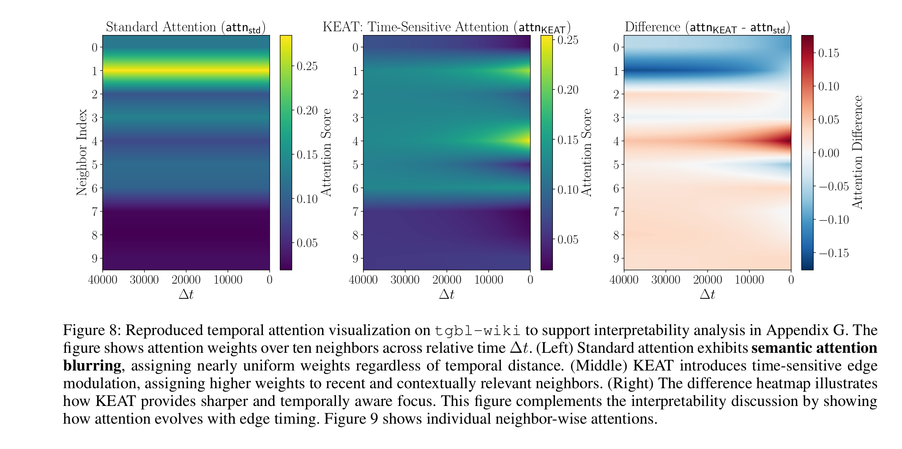

# Kernelized Edge Attention (KEAT)

**"Kernelized Edge Attention: Addressing Semantic Attention Blurring in Temporal Graph Neural Networks"**

**AAAI 2026**
---

### Authors

**Govind Waghmare¹**, **Srini Rohan Gujulla Leel¹**, **Nikhil Tumbde¹\***, **Sumedh B G¹\***, **Sonia Gupta¹**, **Srikanta Bedathur²**  
¹ *Mastercard AI Garage*  
² *Indian Institute of Technology, Delhi*  
*\*Equal contribution*

---
### Coming soon...
- Preprint
- Blog post
- [Code](https://github.com/waghmaregovind/KEAT-TemporalGNN) 
- Additional results

---

### Abstract

Temporal Graph Neural Networks (TGNNs) aim to capture the evolving structure and timing of interactions in dynamic graphs. Although many models incorporate time through encodings or architectural design, they often compute attention over entangled node and edge representations, failing to reflect their distinct temporal behaviors. Node embeddings evolve slowly as they aggregate long-term structural context, while edge features reflect transient, timestamped interactions (e.g. messages, trades, or transactions). This mismatch results in semantic attention blurring, where attention weights cannot distinguish between slowly drifting node states and rapidly changing, information-rich edge interactions. As a result, models struggle to capture fine-grained temporal dependencies and provide limited transparency into how temporal relevance is computed. This paper introduces KEAT (Kernelized Edge Attention for Temporal Graphs), a novel attention formulation that modulates edge features using a family of continuous-time kernels, including Laplacian, RBF, and learnable MLP variant. KEAT preserves the distinct roles of nodes and edges, and integrates seamlessly with both Transformer-style (e.g., DyGFormer) and message-passing (e.g., TGN) architectures. It achieves up to 18% MRR improvement over the recent DyGFormer and 7% over TGN on link prediction tasks, enabling more accurate, interpretable and temporally aware message passing in TGNNs.

---

### Problem Statement

    

---

### Results

**Attention Visualization**

**Link Prediction Results**

---
